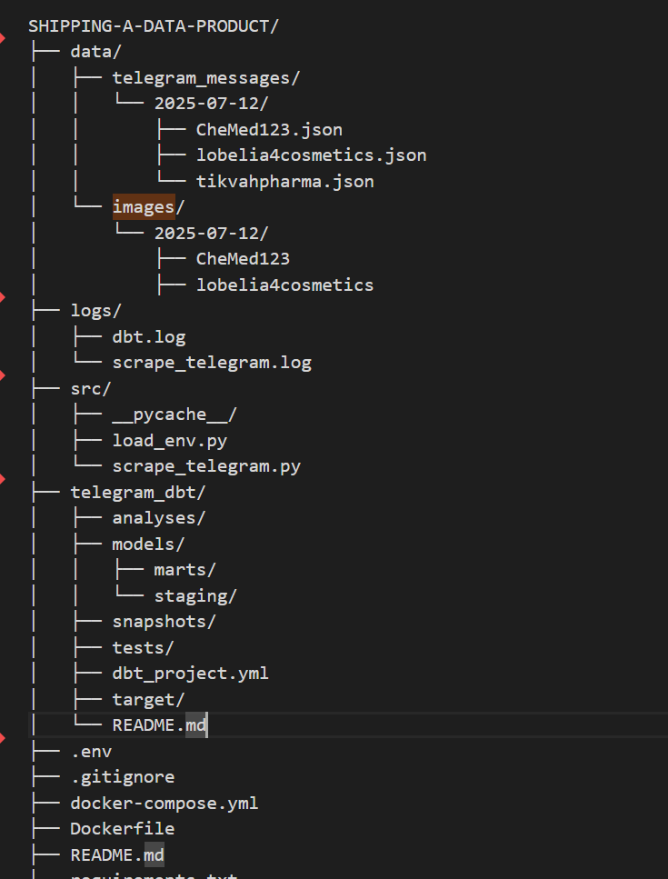

## Setup

```bash
git clone <repo>
```

## Run with Docker Compose

```bash
docker-compose up --build
```

## Run Scripts

```bash
docker-compose exec app python src/db_loader.py
```
# Shipping a Data Product - Interim Submission

## Project Overview

This project involves building an end-to-end ELT pipeline that transforms raw Telegram data about Ethiopian medical businesses into a curated analytical data product. The pipeline leverages technologies such as PostgreSQL, dbt, FastAPI, and Telethon.

## Interim Tasks Completed

- **Completed Staging Model:** `stg_telegram_messages` — a cleaned and normalized staging table that loads raw Telegram message data.
- **Developed Data Mart Models:**
  - `dim_channels`: Dimension table containing metadata about Telegram channels.
  - `dim_dates`: Dimension table with date attributes for time-based analysis.
  - `fct_messages`: Fact table that stores the processed Telegram messages linked to dimension tables.

## Project Structure
```

```
## How to Run

1. **Setup the Environment:**
   - Ensure PostgreSQL is running and accessible.
   - Activate your Python environment with dbt installed.
   - Configure your `profiles.yml` for dbt with connection details.
  ```
2. **Run dbt Models:**
   ```bash
   - dbt run --select stg_telegram_messages dim_channels dim_dates fct_messages
   ```
## Run Tests (if any):**

     dbt test
## Next Steps:**
    - Implement enrichment features for message data (e.g., YOLOv8 image processing).

    - Develop FastAPI analytical endpoints for querying the data product.

     - Schedule pipeline orchestration using Dagster.


